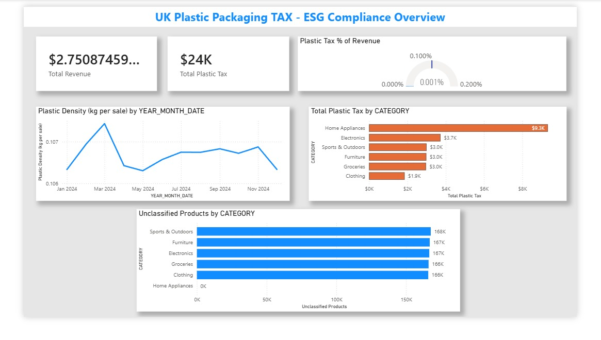

# ESG Plastic Tax Compliance Engine

A scalable **ESG data engineering and analytics system** designed to compute **UK Plastic Packaging Tax exposure** by integrating retail data with sustainability metadata.

This project is built as a **reusable pipeline**, where once the system is set up, **new data can be added without modifying the pipeline or schema**, enabling continuous ESG compliance monitoring and future decision-making.

---

## Problem Statement

Retail systems contain financial data (sales, revenue), but lack ESG attributes like:

- Packaging material
- Plastic weight
- Sustainability indicators

This makes it impossible to:

❌ Calculate plastic packaging tax  
❌ Identify compliance risks  
❌ Support ESG-driven decisions  

---

## ⚙️ Solution Overview

This project implements a **Snowflake-based Medallion Architecture** where:

- Raw, cleaned, and enriched data layers are maintained
- ESG enrichment and tax calculations are handled using **SQL (not Python)**
- Power BI is directly connected to the **Gold layer for analytics**

- Key idea:
Once the pipeline is built, **you only need to load new data into Snowflake — everything else updates automatically**

---

## Architecture (Reusable Data Pipeline)
CSV Data → Snowflake (Bronze → Silver → Gold) → Power BI Dashboard

### 🔹 Bronze Layer
- Raw CSV data loaded into Snowflake  
- Data validation and structure preserved  

### 🔹 Silver Layer
- Data enrichment using SQL joins  
- ESG logic applied (plastic weight, classification)  

### 🔹 Gold Layer
- Aggregations and tax calculations done **entirely in Snowflake using SQL**  
- Output is analytics-ready  

📌 No aggregation logic is handled in Python  
📌 SQL ensures scalability and performance  

---

## How the System Works (Important)

### Initial Setup:
1. Load CSV data into Snowflake  
2. Run SQL scripts for Bronze → Silver → Gold  
3. Connect Power BI to Gold layer  

---

### After Setup (Key Feature 🚀)

👉 To update the system:
- Add new data to CSV  
- Load into Snowflake  

✔ No schema change required  
✔ No pipeline modification required  
✔ Power BI updates automatically  

---

## ESG Analytics Dashboard



- This dashboard is directly connected to the **Gold layer in Snowflake**  
- Any new data added reflects automatically  

---

## Key Insights

Based on the dashboard (from report  [oai_citation:0‡UK Plastic Packaging Tax.pdf](sediment://file_00000000569471fdbd04b1e59a128fe0)):

- Revenue ≈ £2.75B  
- Plastic Tax ≈ £24K  
- Tax % ≈ 0.00087%  

### 🔹 Business Interpretation

- Current tax impact is low  
- But risk increases with:
  - Sales growth  
  - Regulatory changes  
  - Packaging intensity  

---

### 🔹 Risk Insights

- High-risk categories:
  - Home Appliances  
  - Electronics  

- ~833K unclassified products → ESG data gap  

- Missing ESG data = compliance risk  

---

## Why This System is Valuable

This is not just a PoC — it behaves like a **production-ready analytical system**:

✔ Scalable (Snowflake handles large data)  
✔ Reusable (no redesign needed for new data)  
✔ Automated insights (Power BI auto-refresh)  
✔ Business-ready (decision-making enabled)  

---

## Tech Stack

| Layer            | Technology |
|------------------|-----------|
| Data Warehouse   | Snowflake |
| Transformation   | SQL (Bronze, Silver, Gold layers) |
| Processing       | Python (only for preprocessing, not aggregation) |
| Storage          | CSV, Parquet |
| BI & Analytics   | Power BI |
| Data Model       | Star Schema |

---

## 📁 Project Structure
Esg-Plastic-Tax-Compliance-Engine/
│
├── data/
│   ├── raw/
│   ├── silver/
│   ├── gold/
│   ├── reference/
│   └── retail/
│
├── sql/
│   ├── bronze_layer.sql
│   ├── silver_layer.sql
│   └── gold_layer.sql
│
├── scripts/
│   ├── profile_raw.py
│   ├── silver_enrich_fuzzy.py
│   └── gold_aggregate.py
│
├── docs/
│   ├── ESG_dashboard.png
│   └── report.pdf
│
└── requirements.txt

---

## How to Run (Initial Setup)

```bash
# Install dependencies
pip install -r requirements.txt
Step 1: Load CSV into Snowflake

Step 2: Run SQL scripts (Bronze → Silver → Gold)

Step 3: Connect Power BI to Gold layer
```

---

## 🔁 Future Usage (MOST IMPORTANT)

- To analyse new data:
	1.	Add new CSV data
	2.	Load into Snowflake
	3.	Refresh Power BI

✅ No pipeline changes
✅ No schema changes
✅ No reprocessing logic needed

⸻

## Key Learnings
	•	SQL-based transformations scale better than Python pipelines
	•	Medallion architecture enables clean data separation
	•	ESG analytics depends heavily on data enrichment
	•	Designing reusable pipelines is more valuable than one-time solutions

---

## Future Improvements
	•	Supplier-level packaging data
	•	NLP-based ESG classification
	•	Scenario simulation (tax changes)
	•	Incremental loading in Snowflake

---

## Author

**Samuel Sathiyamoorthy**
MSc Cloud Computing – Newcastle University
ssamuelpillai@gmail.com
